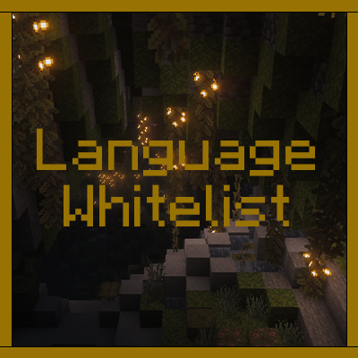

<p align="center">
  
</p>

# Language Whitelist

Language Whitelist is a lightweight client-side mod that filters the Minecraft Language menu and shows only the languages selected in its configuration file.

This version supports Minecraft 1.21 on Fabric Loader and Quilt Loader. Fabric API is not required.

## Features

- Shows only the configured languages in the Language menu
- Creates a configuration file automatically on the first launch
- Accepts language codes without case sensitivity
- Supports Fabric Loader and Quilt Loader with the same JAR file
- Works entirely on the client side
- Restores the full language list when filtering is disabled or no configured language is available
- Backs up a broken configuration before restoring the default file

## Compatibility

| Component | Supported version |
| --- | --- |
| Minecraft | 1.21 |
| Fabric Loader | 0.14.25 or newer |
| Quilt Loader | A version compatible with Minecraft 1.21 |
| Java at runtime | 21 or newer |

## Installation

1. Install Fabric Loader or Quilt Loader for Minecraft 1.21.
2. Place the Language Whitelist JAR file in the `mods` folder.
3. Start the game once to create the configuration file.
4. Close the game and edit `config/langwhitelist-client.toml`.
5. Start the game again to apply the configuration.

The mod is client-side only and does not need to be installed on a dedicated server.

## Configuration

The configuration file is created at:

```text
config/langwhitelist-client.toml
```

Default configuration:

```toml
# List of language codes that should be visible in Language menu.
# Examples: en_us, ru_ru
# Special values: "*" or "all" = show all languages.
# Empty list = show all languages.
allowed_languages = ["en_us", "ru_ru"]
```

Replace the values in `allowed_languages` with the language codes you want to keep visible.

Example:

```toml
allowed_languages = ["en_us", "de_de", "fr_fr"]
```

Language codes are processed without case sensitivity, so `EN_US` and `en_us` are treated as the same value.

The following values disable filtering and show every available language:

```toml
allowed_languages = []
```

```toml
allowed_languages = ["*"]
```

```toml
allowed_languages = ["all"]
```

Invalid language codes are ignored. If no valid configured language remains, or if none of the configured languages are available in the current game instance, the complete language list is shown.

If the configuration cannot be read, the mod moves it to a backup file with a name similar to:

```text
langwhitelist-client.toml.broken-20260725-120000
```

A new configuration file with the default values is then created.

## Building from source

### Requirements

- JDK 21
- An internet connection for the first Gradle build

### Windows

```powershell
.\gradlew.bat build
```

### Linux and macOS

```sh
./gradlew build
```

The compiled files are placed in `build/libs`.

Use the regular JAR file for installation. The file ending in `-sources.jar` contains source code and is not the installable mod file.

## Reporting problems

When reporting a problem, include:

- The Minecraft version
- The mod loader and its version
- The Language Whitelist version
- The contents of `langwhitelist-client.toml`
- The relevant lines from the game log

## License

Language Whitelist is available under the [MIT License](LICENSE).

Copyright 2026 Riabov
